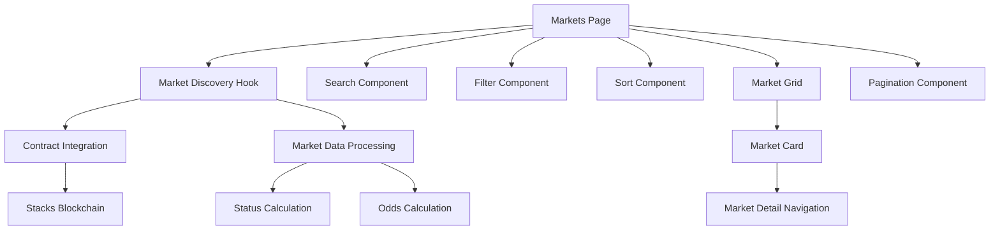

# Market Discovery & Filtering System Design

## Overview

The Market Discovery & Filtering System provides a comprehensive interface for users to browse, search, and filter prediction markets. The system integrates with the existing Predinex smart contract to fetch real market data and presents it through an intuitive, responsive web interface with advanced filtering and sorting capabilities.

## Architecture

The system follows a client-side architecture with React components that interact with the Stacks blockchain through the existing wallet connection infrastructure. The design emphasizes performance through efficient data fetching, client-side filtering, and optimized rendering.



## Components and Interfaces

### Core Components

1. **MarketsPage**: Main page component orchestrating the market discovery experience
2. **MarketGrid**: Grid layout component displaying market cards with responsive design
3. **MarketCard**: Individual market display component with key information and navigation
4. **SearchBar**: Text input component for keyword-based market filtering
5. **FilterControls**: Status-based filtering interface (All, Active, Settled, Expired)
6. **SortControls**: Dropdown for sorting markets by different criteria
7. **Pagination**: Navigation component for browsing multiple pages of markets

### Data Interfaces

```typescript
interface PoolData {
  poolId: number;
  creator: string;
  title: string;
  description: string;
  outcomeAName: string;
  outcomeBName: string;
  totalA: bigint;
  totalB: bigint;
  settled: boolean;
  winningOutcome: number | null;
  createdAt: number;
  settledAt: number | null;
  expiry: number;
}

interface ProcessedMarket {
  poolId: number;
  title: string;
  description: string;
  outcomeA: string;
  outcomeB: string;
  totalVolume: number;
  oddsA: number;
  oddsB: number;
  status: 'active' | 'settled' | 'expired';
  timeRemaining: number | null;
  createdAt: number;
  creator: string;
}

interface MarketFilters {
  search: string;
  status: 'all' | 'active' | 'settled' | 'expired';
  sortBy: 'volume' | 'newest' | 'ending-soon';
}

interface PaginationState {
  currentPage: number;
  itemsPerPage: number;
  totalItems: number;
  totalPages: number;
}
```

### Contract Integration

The system integrates with the existing `predinex-pool.clar` contract using these read-only functions:

- `get-pool-count()`: Get total number of pools
- `get-pool(pool-id)`: Get individual pool data
- `get-pools-batch(start-id, count)`: Get multiple pools efficiently
- `get-pool-stats(pool-id)`: Get calculated statistics for a pool

## Data Models

### Market Status Calculation

Market status is derived from on-chain data:

```typescript
function calculateMarketStatus(pool: PoolData, currentBlockHeight: number): MarketStatus {
  if (pool.settled) return 'settled';
  if (currentBlockHeight > pool.expiry) return 'expired';
  return 'active';
}
```

### Odds Calculation

Odds are calculated based on total bets on each outcome:

```typescript
function calculateOdds(totalA: bigint, totalB: bigint): { oddsA: number; oddsB: number } {
  const total = Number(totalA + totalB);
  if (total === 0) return { oddsA: 50, oddsB: 50 };
  
  return {
    oddsA: Math.round((Number(totalA) / total) * 100),
    oddsB: Math.round((Number(totalB) / total) * 100)
  };
}
```

### Time Remaining Calculation

For active markets, calculate blocks until expiry:

```typescript
function calculateTimeRemaining(expiry: number, currentBlockHeight: number): number | null {
  if (currentBlockHeight >= expiry) return null;
  return expiry - currentBlockHeight;
}
```

## Correctness Properties

*A property is a characteristic or behavior that should hold true across all valid executions of a system-essentially, a formal statement about what the system should do. Properties serve as the bridge between human-readable specifications and machine-verifiable correctness guarantees.*

Property 1: Market card information completeness
*For any* market data, when rendering a market card, the displayed content should include title, description, both outcome names, total volume, market status, time/settlement info, and current odds
**Validates: Requirements 2.1, 2.2, 2.3, 2.4, 2.5, 2.6, 2.7**

Property 2: Search filtering accuracy
*For any* search query and market dataset, all returned results should have titles or descriptions that contain the search query (case-insensitive)
**Validates: Requirements 3.1, 3.2, 3.5**

Property 3: Status filtering correctness
*For any* status filter selection and market dataset, all returned results should match the selected status criteria based on settled flag and expiry block height
**Validates: Requirements 4.1, 4.2, 4.3, 4.5**

Property 4: Sort order consistency
*For any* sort criteria and market dataset, the returned results should be ordered correctly according to the selected sort field (volume descending, creation time descending, or expiry time ascending)
**Validates: Requirements 5.1, 5.2, 5.3**

Property 5: Sort preservation during filtering
*For any* active sort order, when applying search or status filters, the sort order should be maintained in the filtered results
**Validates: Requirements 5.4**

Property 6: Pagination size consistency
*For any* dataset larger than 12 items, each page should display exactly 12 markets (except the last page which may have fewer)
**Validates: Requirements 6.6**

Property 7: Pagination navigation accuracy
*For any* pagination state, clicking next/previous should display the correct page of results based on current page and items per page
**Validates: Requirements 6.2, 6.3**

Property 8: Pagination information accuracy
*For any* paginated dataset, the displayed current page number and total pages should correctly reflect the pagination state
**Validates: Requirements 6.7**

Property 9: Navigation parameter correctness
*For any* market card click, the navigation should include the correct pool ID as a URL parameter
**Validates: Requirements 7.2**

Property 10: Market status calculation accuracy
*For any* pool data and current block height, the calculated market status should correctly reflect whether the market is active, settled, or expired
**Validates: Requirements 4.5**

## Error Handling

The system implements comprehensive error handling:

1. **Network Errors**: Retry mechanisms with exponential backoff for contract calls
2. **Invalid Data**: Graceful handling of malformed pool data with fallback displays
3. **Empty States**: Clear messaging when no markets exist or match filters
4. **Loading States**: Progressive loading indicators during data fetching
5. **Pagination Errors**: Boundary checking to prevent invalid page navigation

## Testing Strategy

### Unit Testing Approach

Unit tests will cover:
- Individual component rendering with mock data
- Filter and search logic functions
- Pagination calculation utilities
- Market status and odds calculation functions
- Error boundary behavior
- Navigation event handling

### Property-Based Testing Approach

The system will use **fast-check** as the property-based testing library for JavaScript/TypeScript. Each property-based test will run a minimum of 100 iterations to ensure comprehensive coverage.

Property-based tests will verify:
- Market card rendering completeness across random market data
- Search filtering accuracy with random queries and datasets
- Status filtering correctness with random market states
- Sort order consistency with random market collections
- Pagination behavior with random dataset sizes
- Market status calculation with random block heights and pool states

Each property-based test will be tagged with comments referencing the specific correctness property from this design document using the format: **Feature: market-discovery, Property {number}: {property_text}**

### Integration Testing

Integration tests will verify:
- End-to-end market discovery workflow
- Contract integration with real blockchain data
- Wallet connection integration for authenticated features
- Navigation flow between market discovery and detail pages

## Performance Considerations

1. **Lazy Loading**: Markets are fetched in batches to reduce initial load time
2. **Client-Side Filtering**: Search and filter operations are performed on cached data
3. **Debounced Search**: Search input is debounced to prevent excessive filtering
4. **Memoization**: Expensive calculations (odds, status) are memoized
5. **Virtual Scrolling**: For large datasets, implement virtual scrolling to maintain performance

## Security Considerations

1. **Input Sanitization**: All search queries are sanitized to prevent XSS attacks
2. **Contract Validation**: All data from smart contracts is validated before display
3. **Rate Limiting**: Contract calls are rate-limited to prevent abuse
4. **Error Information**: Error messages don't expose sensitive system information