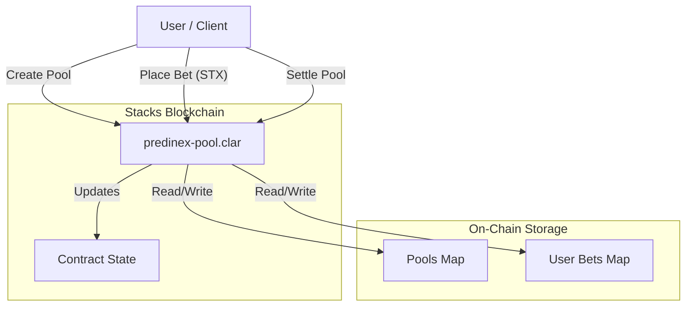
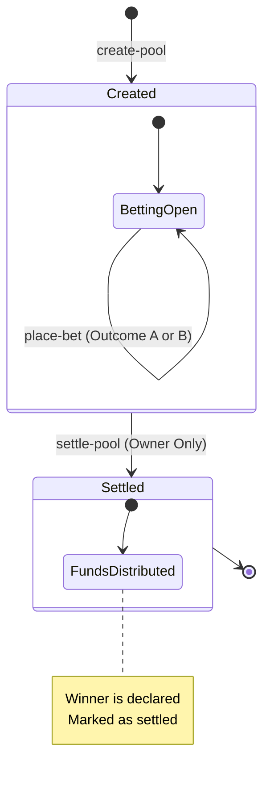

# Predinex Stacks - Decentralized Prediction Market

Predinex is a decentralized prediction market built on the Stacks blockchain. It allows users to create prediction pools, place bets on binary outcomes (e.g., "Yes" vs "No"), and settle markets in a transparent and trustless manner using Clarity smart contracts.

  

## 🏗 System Architecture

The project consists of a Clarity smart contract (`predinex-pool`) that manages the state of all prediction pools and funds. Users interact with the contract directly or through TypeScript scripts/frontend applications.



## 🔄 Workflow

The lifecycle of a prediction pool follows a linear flow from creation to settlement.



## ✨ Features

- **Create Prediction Pools**: Anyone creating a pool can define the title, description, and two outcomes.
- **Binary Betting**: Users can bet STX on one of two outcomes (Outcome A or Outcome B).
- **Automated Bookkeeping**: The contract tracks total bets for each side and individual user positions.
- **Settlement**: The pool creator can settle the market, determining the winning outcome (functionality for claiming winnings would be the logical next step).
- **Transparency**: All pool data, bets, and results are publicly verifiable on the Stacks blockchain.

## 🛠 Prerequisites

Ensure you have the following installed:

- [Node.js](https://nodejs.org/) (v16+)
- [Clarinet](https://github.com/hirosystems/clarinet) (for local Clarinet orchestration)
- [Git](https://git-scm.com/)

## 🚀 Installation

1.  **Clone the repository**
    ```bash
    git clone <repository-url>
    cd predinex-stacks
    ```

2.  **Install dependencies**
    ```bash
    npm install
    ```

## 🧪 Testing

This project uses Vitest with `vitest-environment-clarinet` for comprehensive unit testing.

To run the tests:

```bash
npm run test
```

To generate a coverage report:

```bash
npm run test:report
```

## 📜 Deployment

The project includes scripts to facilitate deployment to the Stacks network (Testnet/Mainnet).

1.  **Configure Environment**
    Ensure your `.env` file is set up with your deployer key and network settings.

2.  **Run Deploy Script**
    ```bash
    npm run deploy
    ```

## 💻 Usage

You can also interact with the contract using the provided interaction script:

```bash
npm run interact
```

### Smart Contract Functions

| Function | Type | Description |
| :--- | :--- | :--- |
| `create-pool` | Public | Creates a new prediction market pool. |
| `place-bet` | Public | Places a bet on Outcome A (0) or Outcome B (1). |
| `settle-pool` | Public | Settles the pool and declares a winner (Creator only). |
| `get-pool` | Read-Only | Retrieves details of a specific pool. |
| `get-user-bet` | Read-Only | Retrieves a user's betting position for a pool. |

## 🤝 Contributing

Contributions are welcome! Please feel free to submit a Pull Request.

## 📄 License

This project is licensed under the ISC License.