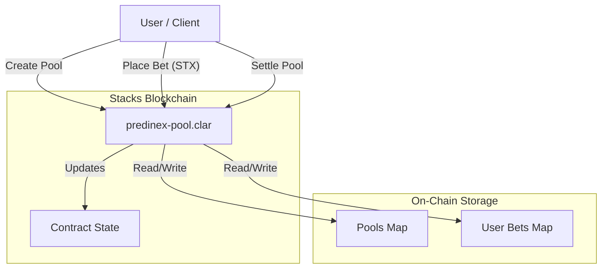
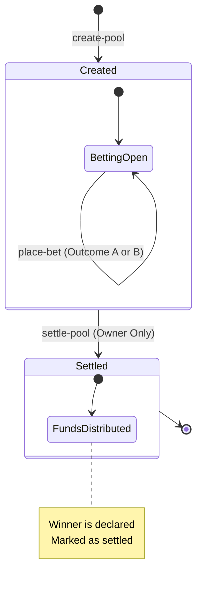

# Predinex Stacks - Decentralized Prediction Market

Predinex is a decentralized prediction market built on the Stacks blockchain. It allows users to create prediction pools, place bets on binary outcomes (e.g., "Yes" vs "No"), and settle markets in a transparent and trustless manner using Clarity smart contracts.

**🆕 NEW: Automated Market Resolution System** - Markets can now be settled automatically using oracle data feeds, with community dispute mechanisms and fallback options.

  

## 📜 Deployment

### Deployed Contracts (v2 - Latest)

All contracts are deployed on **Stacks Mainnet** with full integration:

| Contract | Address | Transaction | Status |
| :--- | :--- | :--- | :--- |
| `predinex-oracle-registry` | `SP2W_EJMBN.predinex-oracle-registry-1769574272753` | [View TX](https://explorer.hiro.so/txid/0xd47f3e7e6c7c8c32102158c7668f0c4556b8d4015065f3f3f2f1bc3a5a4d580?chain=mainnet) | ✅ Confirmed |
| `liquidity-incentives` | `SP2W_EJMBN.liquidity-incentives-1769574671620` | [View TX](https://explorer.hiro.so/txid/0x03_e6cd8?chain=mainnet) | ✅ Confirmed |
| `predinex-pool` | `SP2W_EJMBN.predinex-pool-1771470759824` | [View TX](https://explorer.hiro.so/txid/34008e36bb074545f5b08c1add330196b47bae093a770b8727ce2e007f4ef311?chain=mainnet) | ✅ Confirmed |
| `predinex-resolution-engine` | `SP2W_EJMBN.predinex-resolution-engine-1771470766226` | [View TX](https://explorer.hiro.so/txid/e9376447ebb76c4bf9800e840fb998d2e5455b5c36235a755da7f40ccdbe9518?chain=mainnet) | ✅ Confirmed |

### Previous Deployment (v1)

| Contract | Address |
| :--- | :--- |
| `predinex-pool` (v1) | `SPENV2J0V4BHRFAZ6FVF97K9ZGQJ0GT19RC3JFN7.predinex-pool-1766043971498` |

## 🏗 System Architecture

The project consists of a Clarity smart contract (`predinex-pool`) that manages the state of all prediction pools and funds. Users interact with the contract directly or through TypeScript scripts/frontend applications.

## 🖥️ Frontend Application

The Predinex frontend is a modern Next.js application designed with professional UI/UX, accessibility, and high performance in mind.

### Core Features
- **Premium Design System**: Glassmorphism, institutional aesthetics, and smooth animations.
- **Stacks SDK v7+ Integration**: Full compatibility with the latest Stacks transactions and network libraries.
- **Multi-Wallet Support**: Integrated with Hiro, Leather, and Xverse via `@stacks/connect`.
- **Responsive & Accessible**: Optimized for all screen sizes with WCAG-compliant ARIA labels and heading structures.

For detailed frontend architecture, component breakdown, and styling guides, please refer to [FRONTEND.md](./web/FRONTEND.md).



## 🔄 Workflow

The lifecycle of a prediction pool follows a linear flow from creation to settlement.



## ✨ Features

- **Create Prediction Pools**: Anyone creating a pool can define the title, description, and two outcomes.
- **Binary Betting**: Users can bet STX on one of two outcomes (Outcome A or Outcome B).
- **Automated Bookkeeping**: The contract tracks total bets for each side and individual user positions.
- **🆕 Automated Resolution**: Markets can be settled automatically using oracle data feeds.
- **🆕 Oracle System**: Decentralized oracle providers submit external data for market resolution.
- **🆕 Dispute Mechanism**: Community-driven dispute resolution for contested automated settlements.
- **🆕 Fee Distribution**: Automatic fee distribution to oracle providers and platform.
- **🆕 Fallback Resolution**: Manual settlement when automated systems fail.
- **🆕 Liquidity Incentives**: Advanced rewards system including Early Bird, Volume, Referral, and Loyalty bonuses.
- **🆕 Reward Leaderboard**: Real-time tracking of top incentive earners per pool.
- **🆕 Dynamic Bonus Rates**: Pool-specific bonus configurations for flexible incentive management.
- **🆕 Vesting Schedule**: Enforced 1-week vesting period for all incentive claims to ensure ecosystem stability.
- **Settlement**: The pool creator can settle the market, determining the winning outcome (functionality for claiming winnings would be the logical next step).
- **Transparency**: All pool data, bets, and results are publicly verifiable on the Stacks blockchain.

## 🛠 Prerequisites

Ensure you have the following installed:

- [Node.js](https://nodejs.org/) (v16+)
- [Clarinet](https://github.com/hirosystems/clarinet) (for local Clarinet orchestration)
- [Git](https://git-scm.com/)

## 🚀 Installation

1.  **Clone the repository**
    ```bash
    git clone <repository-url>
    cd predinex-stacks
    ```

2.  **Install dependencies**
    ```bash
    npm install
    ```

## 🧪 Testing

This project uses Vitest with `vitest-environment-clarinet` for comprehensive unit testing.

To run the tests:

```bash
npm run test
```

To generate a coverage report:

```bash
npm run test:report
```

    npm run deploy
    ```

## 💻 Usage

You can also interact with the contract using the provided interaction script:

```bash
npm run interact
```

### 🆕 Automated Resolution System

The new automated resolution system allows markets to be settled without manual intervention:

#### Oracle Provider Setup
```bash
# Test oracle system
npm run test:oracle

# Simulate oracle providers
npx tsx scripts/simulate-oracle-provider.ts

# API integration example
npx tsx scripts/api-integration-example.ts
```

#### Dispute System Testing
```bash
# Test dispute mechanisms
npx tsx scripts/simulate-dispute-system.ts
```

#### Performance Monitoring
```bash
# Monitor system performance
npx tsx scripts/performance-monitor.ts
```

#### Complete Integration Test
```bash
# Run full system integration test
npx tsx scripts/final-integration-test.ts
```

For detailed documentation on the automated resolution system, see [AUTOMATED_RESOLUTION_GUIDE.md](./AUTOMATED_RESOLUTION_GUIDE.md).

### Smart Contract Functions

| Function | Type | Description |
| :--- | :--- | :--- |
| `create-pool` | Public | Creates a new prediction market pool. |
| `place-bet` | Public | Places a bet on Outcome A (0) or Outcome B (1). |
| `settle-pool` | Public | Settles the pool and declares a winner (Creator only). |
| `get-pool` | Read-Only | Retrieves details of a specific pool. |
| `get-user-bet` | Read-Only | Retrieves a user's betting position for a pool. |

### 🆕 Automated Resolution Functions

| Function | Type | Description |
| :--- | :--- | :--- |
| `register-oracle-provider` | Public | Registers a new oracle provider (Admin only). |
| `submit-oracle-data` | Public | Submits data for market resolution (Oracle only). |
| `configure-pool-resolution` | Public | Configures automated resolution for a pool. |
| `attempt-automated-resolution` | Public | Attempts to resolve a pool using oracle data. |
| `create-dispute` | Public | Creates a dispute for an automated resolution. |
| `vote-on-dispute` | Public | Votes on a disputed resolution. |
| `resolve-dispute` | Public | Resolves a dispute after voting period. |
| `trigger-fallback-resolution` | Public | Triggers manual resolution fallback. |
| `collect-resolution-fee` | Public | Collects fees for automated resolution. |
| `claim-oracle-fee` | Public | Allows oracles to claim their fees. |

### 🆕 Liquidity Incentive Functions

| Function | Type | Description |
| :--- | :--- | :--- |
| `initialize-pool-incentives` | Public | Initializes incentive structures for a new pool. |
| `adjust-bonus-rates` | Public | Adjusts dynamic bonus percentages for a specific pool (Owner only). |
| `claim-incentive` | Public | Claims earned incentives after vesting period. |
| `get-top-earners` | Read-Only | Retrieves the leaderboard for a specific pool. |
| `calculate-vesting-schedule` | Read-Only | Calculates the current vesting status of an earned incentive. |
| `get-leaderboard-analytics` | Read-Only | Provides participation and earning analytics for a pool. |

## 🛣️ Roadmap to Launch

To ensure Predinex becomes the premier destination for prediction markets on Bitcoin, we have defined the following milestones:

### Phase 1: Core Infrastructure (COMPLETED)
- ✅ Mainnet deployment of core contracts (v2).
- ✅ Integration with Stacks Blockchain API for real-time data.
- ✅ Automated Resolution Engine and Oracle Registry.

### Phase 2: Enhanced User Experience (IN PROGRESS)
- 🔄 Real on-chain data integration for the frontend (replacing mocks).
- 🔄 Professional Oracle Feeder system bridging real BTC prices.
- ⏳ Mobile-first responsive design refinements.
- ⏳ Wallet integration with Hiro and Leather wallets.

### Phase 3: Ecosystem Expansion (Q2 2026)
- 📅 Integration with Stacks Nakamoto upgrade features.
- 📅 Decentralized dispute resolution UI for community participation.
- 📅 Multi-token support for prediction pools (sBTC, ALTI).
- 📅 Governance dashboard for platform parameter updates.

---

## 📖 User Guide

### For Traders
1. **Connect Wallet**: Use the "Connect Wallet" button to sync your Stacks address.
2. **Explore Markets**: Browse active markets on the Dashboard.
3. **Place Bets**: Select an outcome and enter the amount of STX you wish to wager.
4. **Claim Winnings**: Once a market is settled, if you won, navigate to the pool and click "Claim Winnings".

### For Oracle Providers
1. **Register**: Use the `predinex-oracle-registry` to register your provider address.
2. **Monitor**: Watch for expired pools that require resolution.
3. **Submit**: Run the `real-oracle-feeder.ts` script to bridge real-world data:
   ```bash
   npx tsx scripts/real-oracle-feeder.ts <pool-id>
   ```

---

## 🤝 Contributing

Contributions are welcome! Please feel free to submit a Pull Request. We prioritize **meaningful** functional improvements over cosmetic changes.

## 📄 License

This project is licensed under the ISC License.