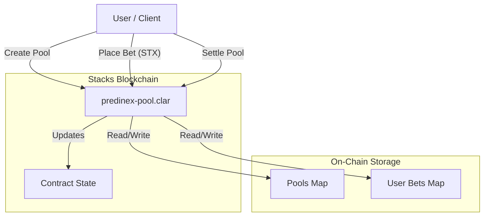
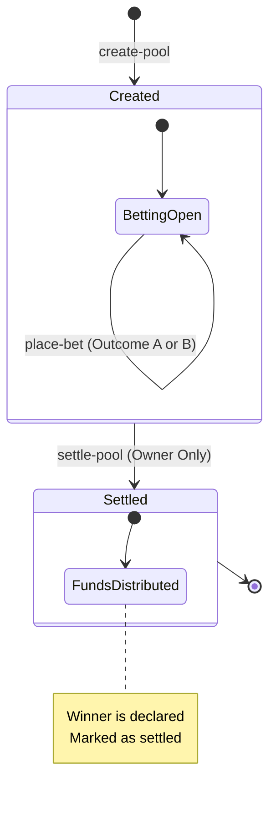

# Predinex Stacks - Decentralized Prediction Market

Predinex is a decentralized prediction market built on the Stacks blockchain. It allows users to create prediction pools, place bets on binary outcomes (e.g., "Yes" vs "No"), and settle markets in a transparent and trustless manner using Clarity smart contracts.

**🆕 NEW: Automated Market Resolution System** - Markets can now be settled automatically using oracle data feeds, with community dispute mechanisms and fallback options.

  

## 📜 Deployment

### Deployed Contracts

| Network | Contract Name | Address |
| :--- | :--- | :--- |
| **Mainnet** | `predinex-pool` | `SPSHVWJVD3NP8G7ZM82KTHB91HKCMNTY3BKKNE5V.predinex-pool-1766043971498` |
| **Mainnet** | `liquidity-incentives` | `SPSHVWJVD3NP8G7ZM82KTHB91HKCMNTY3BKKNE5V.liquidity-incentives` |

## 🏗 System Architecture

The project consists of a Clarity smart contract (`predinex-pool`) that manages the state of all prediction pools and funds. Users interact with the contract directly or through TypeScript scripts/frontend applications.



## 🔄 Workflow

The lifecycle of a prediction pool follows a linear flow from creation to settlement.



## ✨ Features

- **Create Prediction Pools**: Anyone creating a pool can define the title, description, and two outcomes.
- **Binary Betting**: Users can bet STX on one of two outcomes (Outcome A or Outcome B).
- **Automated Bookkeeping**: The contract tracks total bets for each side and individual user positions.
- **🆕 Automated Resolution**: Markets can be settled automatically using oracle data feeds.
- **🆕 Oracle System**: Decentralized oracle providers submit external data for market resolution.
- **🆕 Dispute Mechanism**: Community-driven dispute resolution for contested automated settlements.
- **🆕 Fee Distribution**: Automatic fee distribution to oracle providers and platform.
- **🆕 Fallback Resolution**: Manual settlement when automated systems fail.
- **🆕 Liquidity Incentives**: Advanced rewards system including Early Bird, Volume, Referral, and Loyalty bonuses.
- **🆕 Reward Leaderboard**: Real-time tracking of top incentive earners per pool.
- **🆕 Dynamic Bonus Rates**: Pool-specific bonus configurations for flexible incentive management.
- **🆕 Vesting Schedule**: Enforced 1-week vesting period for all incentive claims to ensure ecosystem stability.
- **Settlement**: The pool creator can settle the market, determining the winning outcome (functionality for claiming winnings would be the logical next step).
- **Transparency**: All pool data, bets, and results are publicly verifiable on the Stacks blockchain.

## 🛠 Prerequisites

Ensure you have the following installed:

- [Node.js](https://nodejs.org/) (v16+)
- [Clarinet](https://github.com/hirosystems/clarinet) (for local Clarinet orchestration)
- [Git](https://git-scm.com/)

## 🚀 Installation

1.  **Clone the repository**
    ```bash
    git clone <repository-url>
    cd predinex-stacks
    ```

2.  **Install dependencies**
    ```bash
    npm install
    ```

## 🧪 Testing

This project uses Vitest with `vitest-environment-clarinet` for comprehensive unit testing.

To run the tests:

```bash
npm run test
```

To generate a coverage report:

```bash
npm run test:report
```

    npm run deploy
    ```

## 💻 Usage

You can also interact with the contract using the provided interaction script:

```bash
npm run interact
```

## 🆕 Enhanced Oracle System Features

The oracle system now includes advanced security, performance, and reliability features:

### 🔒 Stake-Based Security
- **Minimum Stake Requirement**: 1000 STX tokens required for oracle registration
- **Automatic Slashing**: 10% stake penalty for malicious behavior
- **Reputation Scoring**: 0-1000 scale based on accuracy and performance
- **Premium Provider Status**: 2x fee multiplier for 95%+ accuracy providers

### 📊 Advanced Data Aggregation
- **Weighted Consensus**: Reputation-based data aggregation
- **Outlier Detection**: Automatic filtering of suspicious submissions
- **Confidence Thresholds**: Minimum 60% confidence for automated resolution
- **Variance Analysis**: Dispute triggering for >20% data variance

### 🛡️ Security Monitoring
- **Collusion Detection**: Identifies coordinated manipulation attempts
- **Circuit Breaker**: Emergency halt during detected attacks
- **Attack Pattern Recognition**: ML-based suspicious behavior detection
- **Permanent Ban System**: Complete stake confiscation for confirmed malicious actors

### ⚡ Performance Optimizations
- **Batch Submissions**: Process up to 20 submissions in single transaction
- **Caching System**: Reduces redundant processing for frequent submissions
- **Gas Optimization**: Efficient storage patterns minimize transaction costs
- **Immediate Confirmations**: Real-time submission receipts

### 🔧 Enhanced Resolution Engine
- **Custom Oracle Requirements**: 1-10 oracle minimum per market
- **Reputation Thresholds**: Configurable minimum reputation (0-1000)
- **Regex Validation**: Custom data validation rules
- **Deadline Enforcement**: Automatic fallback for missed deadlines

#### Oracle Provider Setup
```bash
# Test oracle system
npm run test:oracle

# Simulate oracle providers
npx tsx scripts/simulate-oracle-provider.ts

# API integration example
npx tsx scripts/api-integration-example.ts
```

#### Dispute System Testing
```bash
# Test dispute mechanisms
npx tsx scripts/simulate-dispute-system.ts
```

#### Performance Monitoring
```bash
# Monitor system performance
npx tsx scripts/performance-monitor.ts
```

#### Complete Integration Test
```bash
# Run full system integration test
npx tsx scripts/final-integration-test.ts
```

For detailed documentation on the automated resolution system, see [AUTOMATED_RESOLUTION_GUIDE.md](./AUTOMATED_RESOLUTION_GUIDE.md).

### Smart Contract Functions

| Function | Type | Description |
| :--- | :--- | :--- |
| `create-pool` | Public | Creates a new prediction market pool. |
| `place-bet` | Public | Places a bet on Outcome A (0) or Outcome B (1). |
| `settle-pool` | Public | Settles the pool and declares a winner (Creator only). |
| `get-pool` | Read-Only | Retrieves details of a specific pool. |
| `get-user-bet` | Read-Only | Retrieves a user's betting position for a pool. |

### 🆕 Enhanced Oracle Functions

| Function | Type | Description |
| :--- | :--- | :--- |
| `register-oracle-provider-with-stake` | Public | Registers oracle with minimum 1000 STX stake requirement |
| `submit-enhanced-oracle-data` | Public | Submits data with validation hash and reputation checks |
| `submit-batch-oracle-data` | Public | Processes multiple submissions efficiently |
| `aggregate-oracle-data` | Public | Calculates weighted consensus from multiple sources |
| `update-reputation-score` | Public | Updates provider reputation based on performance |
| `slash-provider-stake` | Public | Penalizes malicious providers (Admin only) |
| `trigger-circuit-breaker` | Public | Activates emergency protection mode |
| `detect-collusion` | Public | Identifies coordinated manipulation attempts |
| `configure-advanced-resolution` | Public | Sets custom oracle requirements per market |
| `attempt-enhanced-resolution` | Public | Resolves markets with consensus validation |
| `permanently-ban-provider` | Public | Bans malicious providers and confiscates stakes |

### 🆕 Liquidity Incentive Functions

| Function | Type | Description |
| :--- | :--- | :--- |
| `initialize-pool-incentives` | Public | Initializes incentive structures for a new pool. |
| `adjust-bonus-rates` | Public | Adjusts dynamic bonus percentages for a specific pool (Owner only). |
| `claim-incentive` | Public | Claims earned incentives after vesting period. |
| `get-top-earners` | Read-Only | Retrieves the leaderboard for a specific pool. |
| `calculate-vesting-schedule` | Read-Only | Calculates the current vesting status of an earned incentive. |
| `get-leaderboard-analytics` | Read-Only | Provides participation and earning analytics for a pool. |

## 🤝 Contributing

Contributions are welcome! Please feel free to submit a Pull Request.

## 📄 License

This project is licensed under the ISC License.