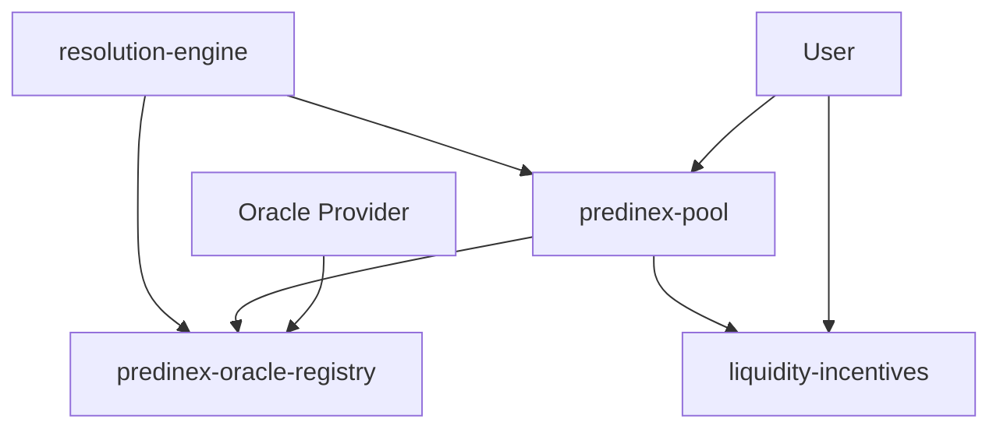

# Contract Architecture

Predinex Stacks consists of four primary Clarity smart contracts that work together to provide a decentralized prediction market.

## Contract Overview

1. **`predinex-pool`**: The core logic contract. It handles pool creation, betting, and manual settlement.
2. **`predinex-oracle-registry`**: A registry for decentralized oracles. It manages oracle registration, reliability scores, and data submissions.
3. **`predinex-resolution-engine`**: Manages automated settlement triggers based on oracle data and handles the dispute resolution process.
4. **`liquidity-incentives`**: Tracks user participation and distributes rewards based on early-bird status, volume, and loyalty.

## Interaction Flow

### Dependency Order
Contracts must be deployed in the following order due to internal contract-calls:
1. `predinex-oracle-registry`
2. `liquidity-incentives`
3. `predinex-pool` (Depends on 1 & 2)
4. `predinex-resolution-engine` (Depends on 1 & 3)
