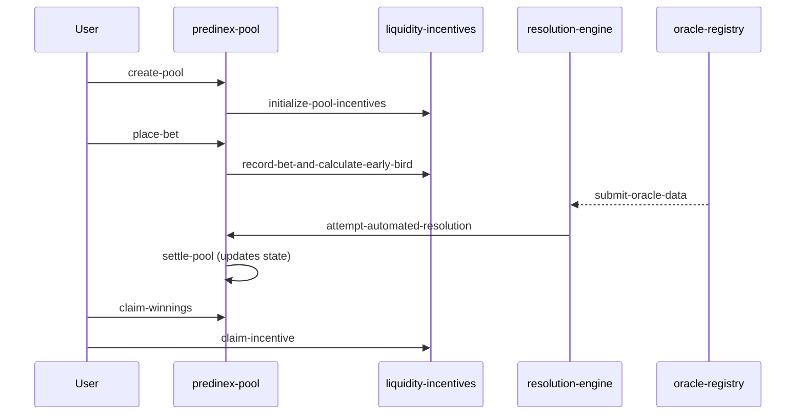

# Contract Architecture

Predinex Stacks consists of four primary Clarity smart contracts that work together to provide a decentralized prediction market.

## Contract Overview

1. **`predinex-pool`**: The core logic contract. It handles pool creation, betting, and manual settlement.
2. **`predinex-oracle-registry`**: A registry for decentralized oracles. It manages oracle registration, reliability scores, and data submissions.
3. **`predinex-resolution-engine`**: Manages automated settlement triggers based on oracle data and handles the dispute resolution process.
4. **`liquidity-incentives`**: Tracks user participation and distributes rewards based on early-bird status, volume, and loyalty.

## Interaction Flow

## Detailed Interaction

```mermaid
sequenceDiagram
    participant U as User
    participant P as predinex-pool
    participant I as liquidity-incentives
    participant R as resolution-engine
    participant O as oracle-registry

    U->>P: create-pool
    P->>I: initialize-pool-incentives
    U->>P: place-bet
    P->>I: record-bet-and-calculate-early-bird
    O-->>R: submit-oracle-data
    R->>P: attempt-automated-resolution
    P->>P: settle-pool (updates state)
    U->>P: claim-winnings
    U->>I: claim-incentive
```

### Dependency Order
Contracts must be deployed in the following order due to internal contract-calls:
1. `predinex-oracle-registry`
2. `liquidity-incentives`
3. `predinex-pool` (Depends on 1 & 2)
4. `predinex-resolution-engine` (Depends on 1 & 3)

## Key Features (v1.2.0)

### 1. Automated Resolution Engine
- **Oracle Consensus**: The `predinex-resolution-engine` now supports multi-oracle consensus for automated market settlement.
- **Dispute Resolution**: Implementation of a community-driven dispute mechanism where users can challenge automated resolutions via binary voting.
- **Dynamic Thresholds**: Market creators can configure minimum oracle counts and reputation requirements per-pool.

### 2. Liquidity Incentive Tiering
- **Early-Bird Bonuses**: Automated bonus calculation for early participants based on pool volume milestones.
- **Vesting Logic**: Integrated 7-day vesting for earned incentives to ensure protocol stability and long-term commitment.
- **Leaderboard Integration**: Real-time tracking of top participants and incentive earners.

## Key Features (v1.1.0)

### 1. Enhanced Security
- **Emergency Circuit Breaker**: The `predinex-resolution-engine` now includes a global pause mechanism that can be triggered by admins or the `CONTRACT-OWNER` to halt all resolutions during suspicious activity.
- **Oracle Deregistration**: Providers can safely leave the registry with a 144-block (approx. 24h) stake unlock delay to prevent hit-and-run attacks.

### 2. Market Safety
- **Max Bet Limits**: Users are limited to a maximum total bet across all pools to prevent catastrophic exposure.
- **Pool Cancellation**: Creators can cancel empty pools (zero bets) to clean up stale or incorrect markets.

### 3. Incentives & Loyalty
- **Tier-Based Discounts**: Integration with `liquidity-incentives` provides up to 20% fee rebates for high-volume (Platinum tier) participants.
- **Recursive Discovery**: New crawler utilities support efficient pagination and discovery of active markets.

## Security & Access Control

The Predinex ecosystem uses a multi-layered security approach:

- **Admin Roles**: Specific administrative functions (like registering oracles or adjusting platform parameters) are restricted to the `CONTRACT-OWNER` or authorized `admin` principals.
- **Contract Decoupling**: Contracts interact via `contract-call?`, allowing for modular upgrades and isolation of concerns.
- **Post-Conditions**: All client-side transactions are expected to use strict post-conditions to ensure only the specified amount of STX is transferred.
- **Vesting Periods**: Liquidity incentives are subject to a 1-week vesting period to prevent "pump and dump" behavior and ensure long-term participation.
